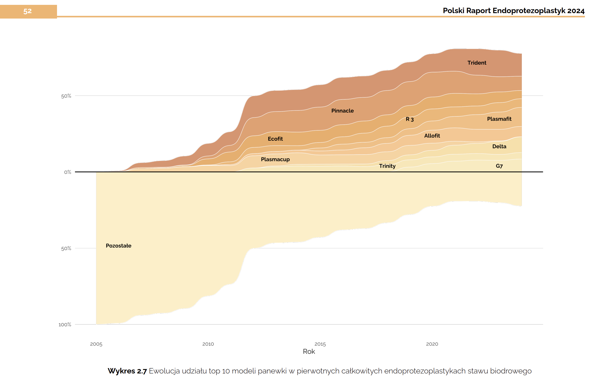
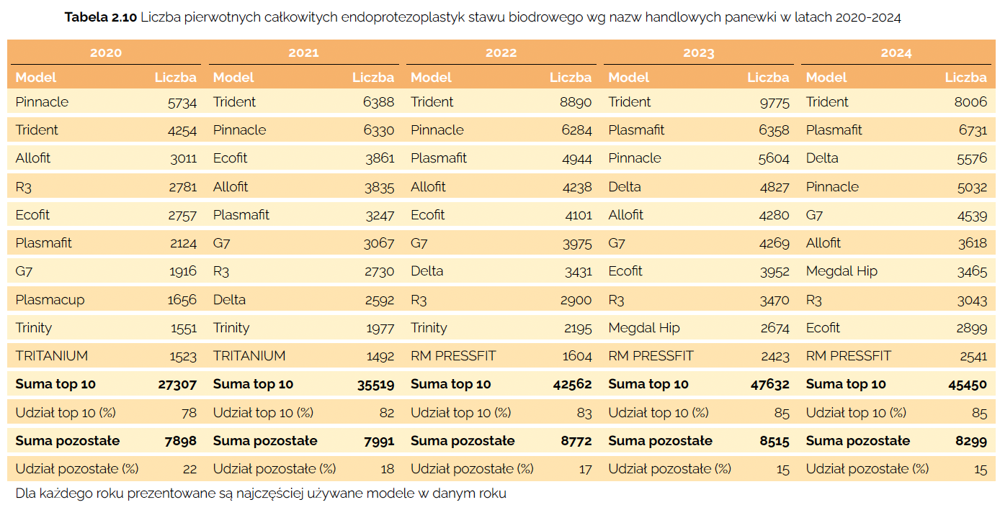
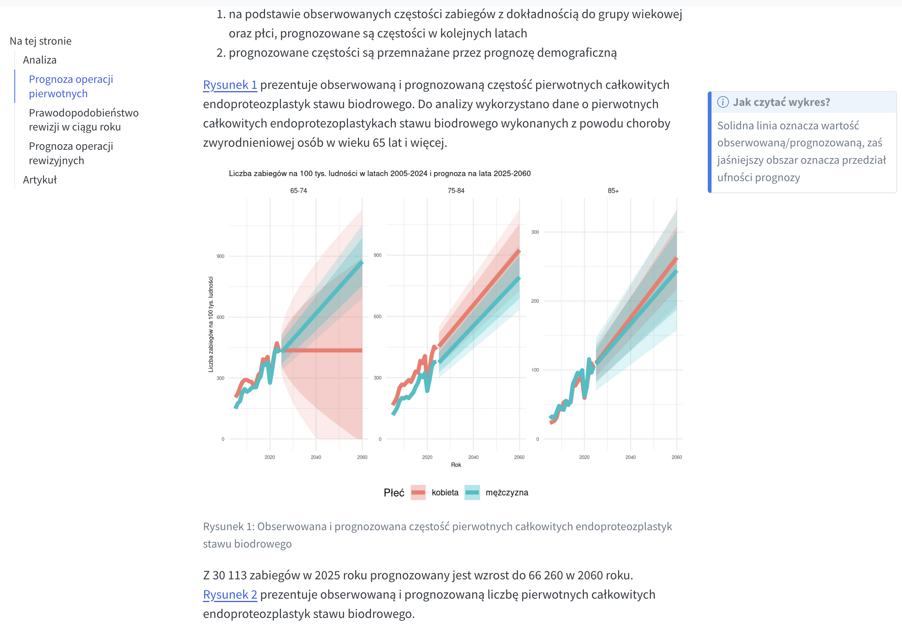

## Introduction

::: {.incremental}
- data analyst
- Polish Arthroplasty Registry
- analyst - clinician collaboration
:::

## Initial State

```{mermaid}
%%| fig-height: 7.5
flowchart TB

  d11([Registry data.xlsx])
  d21([Registry data.csv])
  d12([Registry data.xlsx])
  d22([Registry data.csv])
  d13([Registry data.xlsx])
  d23([Registry data.csv])
  
  s11[/transform_v1.R/]
  s21[/analyse_report.R/]
  s31[/vis_v1.R/]
  s12[/transform_v2.R/]
  s22[/analyse_conf.R/]
  s32[/vis_v2.R/]
  s13[/transform_v3.R/]
  s23[/analyse_adhoc.R/]
  s33[/vis_v3.R/]
  
  t11[Excel]
  t12[Word]
  t21[Excel]
  t22[Power Point]
  t31[Excel]
  t32[Word]
  
  o11[annual_report.docx]
  o21[supplementary.xlsx]
  o12[presentation.pptx]
  o13[custom_analyses.docx]
  o23[supplementary.xlsx]
  
subgraph data1 [ ]
  direction LR
  d11
  d21
end

subgraph script1 [ ]
  s11
  s21
  s31
end

subgraph tool1[ ]
  direction LR
  t11
  t12
end

subgraph output1 [ ]
  direction LR
  o11
  o21
end

subgraph case1 [Annual Report]
  data1 --> script1
  script1 --> tool1
  tool1 --> output1
end

subgraph data2 [ ]
  direction LR
  d12
  d22
end

subgraph script2 [ ]
  s12
  s22
  s32
end

subgraph tool2 [ ]
  direction LR
  t21
  t22
end

subgraph output2 [ ]
  o12
end

subgraph case2 [Conference Presentation]
  data2 --> script2
  script2 --> tool2
  tool2 --> output2
end

subgraph data3 [ ]
  direction LR
  d13
  d23
end

subgraph script3 [ ]
  s13
  s23
  s33
end

subgraph tool3 [ ]
  direction LR
  t31
  t32
end

subgraph output3 [ ]
  direction LR
  o13
  o23
end

subgraph case3 [Ad-hoc analysis]
  data3 --> script3
  script3 --> tool3
  tool3 --> output3
end

case1 ---- case2
case2 ---- case3

classDef highlight fill:#fff3e0,stroke:#fb8c00,color:#e65100;
class t11,t12,t21,t22,t31,t32 highlight;
classDef rfile fill:#276DC3,color:#FFFFFF,stroke:#ffffff;
class s11,s12,s13,s21,s22,s23,s31,s32,s33 rfile;
classDef simple-block fill:#ffffff;
class case1,case2,case3,data1,data2,data3,script1,script2,script3,tool1,tool2,tool3,output1,output2,output3 simple-block;
```

## ETL

```{mermaid}
%%| fig-height: 7.5
flowchart LR

  d11([Registry data.xlsx])
  d21([Registry data.csv])
  d12([database_1])
  d22([database_n])
  
  tn1[R]
  tn2[SQL]
  p1[art.etl]
  
  s21[/analyse_report.R/]
  s31[/vis_v1.R/]
  s22[/analyse_conf.R/]
  s32[/vis_v2.R/]
  s23[/analyse_adhoc.R/]
  s33[/vis_v3.R/]
  
  t11[Excel]
  t12[Word]
  t21[Excel]
  t22[Power Point]
  t31[Excel]
  t32[Word]
  
  o11[annual_report.docx]
  o21[supplementary.xlsx]
  o12[presentation.pptx]
  o13[custom_analyses.docx]
  o23[supplementary.xlsx]
  
subgraph data1 [Source data]
  direction LR
  d11
  d21
end

subgraph data2 [Transformed data]
  direction LR
  d12
  d22
end

subgraph git1 [Github repository]
  direction LR
  tools
  packages
end

tools --> packages

subgraph tools [ ]
  tn1
  tn2
end

subgraph packages [ ]
  p1
end

subgraph idd [ ]
  data1 --> git1
  git1 --> data2
  data2 --> git1
end

idd --> aaa

subgraph script1 [ ]
  s21
  s31
end

subgraph tool1[ ]
  direction LR
  t11
  t12
end

subgraph output1 [ ]
  direction LR
  o11
  o21
end

subgraph case1 [Annual Report]
  direction LR
  script1 --> tool1
  tool1 --> output1
end

subgraph script2 [ ]
  s22
  s32
end

subgraph tool2 [ ]
  direction LR
  t21
  t22
end

subgraph output2 [ ]
  o12
end

subgraph case2 [Conference Presentation]
  direction LR
  script2 --> tool2
  tool2 --> output2
end

subgraph script3 [ ]
  s23
  s33
end

subgraph tool3 [ ]
  direction LR
  t31
  t32
end

subgraph output3 [ ]
  direction LR
  o13
  o23
end

subgraph case3 [Ad-hoc analysis]
  direction LR
  script3 --> tool3
  tool3 --> output3
end

subgraph aaa [ ]
  direction TB
  case1 ---- case2
  case2 ---- case3
end

classDef highlight fill:#fff3e0,stroke:#fb8c00,color:#e65100;
class t11,t12,t21,t22,t31,t32,tn1,tn2 highlight;
classDef highlight2 fill:#80350E,stroke:#fb8c00,color:#ffffff;
class p1 highlight2;
classDef rfile fill:#276DC3,color:#FFFFFF,stroke:#ffffff;
class s11,s12,s13,s21,s22,s23,s31,s32,s33 rfile;
classDef simple-block fill:#ffffff;
class case1,case2,case3,data1,data2,git1,script1,script2,script3,tool1,tool2,tool3,output1,output2,output3,tools,packages simple-block;
classDef simpler-block fill:#ffffff,stroke-dasharray:0 4 0;
class idd,aaa simpler-block;
```

## Visualizations

```{mermaid}
%%| fig-height: 7.5
flowchart LR

  d11([Registry data.xlsx])
  d21([Registry data.csv])
  d12([database_1])
  d22([database_n])
  
  tn1[R]
  tn2[SQL]
  p1[art.etl]
  p2[art.tbl]
  p3[art.fig]
  
  s21[/analyse_report.R/]
  s22[/analyse_conf.R/]
  s23[/analyse_adhoc.R/]
  
  t12[Word]
  t22[Power Point]
  t32[Word]
  
  o11[annual_report.docx]
  o21[supplementary.xlsx]
  o12[presentation.pptx]
  o13[custom_analyses.docx]
  o23[supplementary.xlsx]
  
subgraph data1 [Source data]
  direction LR
  d11
  d21
end

subgraph data2 [Transformed data]
  direction LR
  d12
  d22
end

subgraph git1 [Github repository]
  direction LR
  tools
  packages
end

tools --> packages

subgraph tools [ ]
  tn1
  tn2
end

subgraph packages [ ]
  p1
  p2
  p3
end

subgraph idd [ ]
  data1 --> git1
  git1 --> data2
  data2 --> git1
end

idd --> aaa

subgraph script1 [ ]
  s21
end

subgraph tool1[ ]
  direction LR
  t12
end

subgraph output1 [ ]
  direction LR
  o11
  o21
end

subgraph case1 [Annual Report]
  direction LR
  script1 --> tool1
  tool1 --> output1
end

subgraph script2 [ ]
  s22
end

subgraph tool2 [ ]
  direction LR
  t22
end

subgraph output2 [ ]
  o12
end

subgraph case2 [Conference Presentation]
  direction LR
  script2 --> tool2
  tool2 --> output2
end

subgraph script3 [ ]
  s23
end

subgraph tool3 [ ]
  direction LR
  t32
end

subgraph output3 [ ]
  direction LR
  o13
  o23
end

subgraph case3 [Ad-hoc analysis]
  direction LR
  script3 --> tool3
  tool3 --> output3
end

subgraph aaa [ ]
  direction TB
  case1 ---- case2
  case2 ---- case3
end

classDef highlight fill:#fff3e0,stroke:#fb8c00,color:#e65100;
class t12,t22,t32,tn1,tn2 highlight;
classDef highlight2 fill:#80350E,stroke:#fb8c00,color:#ffffff;
class p1,p2,p3 highlight2;
classDef rfile fill:#276DC3,color:#FFFFFF,stroke:#ffffff;
class s11,s12,s13,s21,s22,s23,s31,s32,s33 rfile;
classDef simple-block fill:#ffffff;
class case1,case2,case3,data1,data2,git1,script1,script2,script3,tool1,tool2,tool3,output1,output2,output3,tools,packages simple-block;
classDef simpler-block fill:#ffffff,stroke-dasharray:0 4 0;
class idd,aaa simpler-block;
```

## Visualizations



## Visualizations



## LaTex

```{mermaid}
%%| fig-height: 7.5
flowchart LR

  d11([Registry data.xlsx])
  d21([Registry data.csv])
  d12([database_1])
  d22([database_n])
  
  tn1[R]
  tn2[SQL]
  tn3[LaTeX]
  p1[art.etl]
  p2[art.tbl]
  p3[art.fig]
  p4[art.rep]
  
  s21[/analyse_report.R/]
  s22[/analyse_conf.R/]
  s23[/analyse_adhoc.R/]
  
  o11[annual_report.docx]
  o21[supplementary.xlsx]
  o12[presentation.pdf]
  o13[custom_analyses.docx]
  o23[supplementary.xlsx]
  
subgraph data1 [Source data]
  direction LR
  d11
  d21
end

subgraph data2 [Transformed data]
  direction LR
  d12
  d22
end

subgraph git1 [Github repository]
  direction LR
  tools
  packages
end

tools --> packages

subgraph tools [ ]
  tn1
  tn2
  tn3
end

subgraph packages [ ]
  p1
  p2
  p3
  p4
end

subgraph idd [ ]
  data1 --> git1
  git1 --> data2
  data2 --> git1
end

idd --> aaa

subgraph script1 [ ]
  s21
end

subgraph output1 [ ]
  direction LR
  o11
  o21
end

subgraph case1 [Annual Report]
  direction LR
  script1 --> output1
end

subgraph script2 [ ]
  s22
end

subgraph output2 [ ]
  o12
end

subgraph case2 [Conference Presentation]
  direction LR
  script2 --> output2
end

subgraph script3 [ ]
  s23
end

subgraph output3 [ ]
  direction LR
  o13
  o23
end

subgraph case3 [Ad-hoc analysis]
  direction LR
  script3 --> output3
end

subgraph aaa [ ]
  direction TB
  case1 ---- case2
  case2 ---- case3
end

classDef highlight fill:#fff3e0,stroke:#fb8c00,color:#e65100;
class tn1,tn2,tn3 highlight;
classDef highlight2 fill:#80350E,stroke:#fb8c00,color:#ffffff;
class p1,p2,p3,p4 highlight2;
classDef rfile fill:#276DC3,color:#FFFFFF,stroke:#ffffff;
class s11,s12,s13,s21,s22,s23,s31,s32,s33 rfile;
classDef simple-block fill:#ffffff;
class case1,case2,case3,data1,data2,git1,script1,script2,script3,output1,output2,output3,tools,packages simple-block;
classDef simpler-block fill:#ffffff,stroke-dasharray:0 4 0;
class idd,aaa simpler-block;
```

## More (version) Control and POSIT

```{mermaid}
%%| fig-height: 7.5
flowchart LR

  d11([Registry data.xlsx])
  d21([Registry data.csv])
  d12([database_1])
  d22([database_n])
  
  tn1[R]
  tn2[SQL]
  tn3[LaTeX]
  p1[art.etl]
  p2[art.tbl]
  p3[art.fig]
  p4[art.rep]
  
  s21[/analyse_report.R/]
  s22[/analyse_conf.R/]
  s23[/analyse_adhoc.R/]
  
  o11[annual_report.docx]
  o21[supplementary.xlsx]
  o12[presentation.pdf]
  o13[custom_analyses.docx]
  o23[supplementary.xlsx]
  
subgraph data1 [Source data]
  direction LR
  d11
  d21
end

subgraph data2 [Transformed data]
  direction LR
  d12
  d22
end

subgraph git1 [Github - packages]
  direction LR
  tools
  packages
end

tools --> packages

subgraph tools [ ]
  tn1
  tn2
  tn3
end

subgraph packages [ ]
  p1
  p2
  p3
  p4
end

subgraph idd [ ]
  data1 --> git1
  git1 --> data2
  data2 --> git1
end

idd --> aaa

subgraph github2 [Github - analysis]
  s21
  s22
  s23
end

subgraph output1 [ ]
  direction LR
  o11
  o21
end

subgraph output2 [ ]
  o12
end

subgraph output3 [ ]
  direction LR
  o13
  o23
end

subgraph static [Email]
  output1
  output2
  output3
end

subgraph posit [POSIT Connect]
  o111[annual_report.html]
  o112[presentation.html]
  o113[analysis.html]
end

subgraph topaaa [ ]
  direction LR
  github2
  overleaf[Overleaf]
end

subgraph downaaa [ ]
  direction LR
  posit
  static
end

subgraph aaa [ ]
  direction TB
  topaaa
  downaaa
end

github2 --> overleaf
github2 --> static
overleaf --> static
github2 --> posit

classDef highlight fill:#fff3e0,stroke:#fb8c00,color:#e65100;
class tn1,tn2,tn3,overleaf highlight;
classDef highlight2 fill:#80350E,stroke:#fb8c00,color:#ffffff;
class p1,p2,p3,p4 highlight2;
classDef rfile fill:#276DC3,color:#FFFFFF,stroke:#ffffff;
class s21,s22,s23 rfile;
classDef simple-block fill:#ffffff;
class case1,case2,case3,data1,data2,git1,script1,script2,script3,output1,output2,output3,tools,packages,static,github2,posit simple-block;
classDef simpler-block fill:#ffffff,stroke-dasharray:0 4 0;
class idd,aaa simpler-block;
classDef dummy-block fill:#ffffff,stroke-dasharray:0 0 0,stroke:#ffffff;
class topaaa,downaaa dummy-block;
```


## More (version) Control and POSIT



## Shiny

```{mermaid}
%%| fig-height: 7.5
flowchart LR

  d11([Registry data.xlsx])
  d21([Registry data.csv])
  d12([database_1])
  d22([database_n])
  
  tn1[R]
  tn2[SQL]
  tn3[LaTeX]
  p1["{art.etl}  {art.tbl}"]
  p3["{art.fig}  {art.rep}"]
  p5["{art.ifig} {art.itbl}"]
  p7["{art.stl}"]
  
  s21[/analyse_report.R/]
  s22[/analyse_conf.R/]
  s23[/analyse_adhoc.R/]
  
  o11[annual_report.docx]
  o21[supplementary.xlsx]
  o12[presentation.pdf]
  o13[custom_analyses.docx]
  o23[supplementary.xlsx]
  
subgraph data1 [Source data]
  direction LR
  d11
  d21
end

subgraph data2 [Transformed data]
  direction LR
  d12
  d22
end

subgraph git1 [Github - packages]
  direction LR
  tools
  packages
end

tools --> packages

subgraph tools [ ]
  tn1
  tn2
  tn3
end

subgraph packages [ ]
  p1
  p3
  p5
  p7
end

subgraph idd [ ]
  data1 --> git1
  git1 --> data2
  data2 --> git1
end

idd --> aaa

subgraph github2 [Github - analysis]
  s21
  s22
  s23
end

subgraph output1 [ ]
  direction LR
  o11
  o21
end

subgraph output2 [ ]
  o12
end

subgraph output3 [ ]
  direction LR
  o13
  o23
end

subgraph static [Email]
  output1
  output2
  output3
end

subgraph posit [POSIT Connect]
  o111[annual_report.html]
  o112[presentation.html]
  o113[analysis.html]
  o114[Shiny]
end

subgraph topaaa [ ]
  direction LR
  github2
  overleaf[Overleaf]
end

subgraph downaaa [ ]
  direction LR
  posit
  static
end

subgraph aaa [ ]
  direction TB
  topaaa
  downaaa
end

github2 --> overleaf
github2 --> static
overleaf --> static
github2 --> posit

classDef highlight fill:#fff3e0,stroke:#fb8c00,color:#e65100;
class tn1,tn2,tn3,overleaf highlight;
classDef highlight2 fill:#80350E,stroke:#fb8c00,color:#ffffff;
class p1,p3,p5,p7 highlight2;
classDef rfile fill:#276DC3,color:#FFFFFF,stroke:#ffffff;
class s21,s22,s23 rfile;
classDef simple-block fill:#ffffff;
class case1,case2,case3,data1,data2,git1,script1,script2,script3,output1,output2,output3,tools,packages,static,github2,posit simple-block;
classDef simpler-block fill:#ffffff,stroke-dasharray:0 4 0;
class idd,aaa simpler-block;
classDef dummy-block fill:#ffffff,stroke-dasharray:0 0 0,stroke:#ffffff;
class topaaa,downaaa dummy-block;
```

## Summary

::: {.incremental}
- improved consistency in data processing and reporting
- reduced annual report preparation time from 4 months to 4 weeks
- increased delivery speed for new analytical documents
- enabled rapid development of tailored applications
:::
